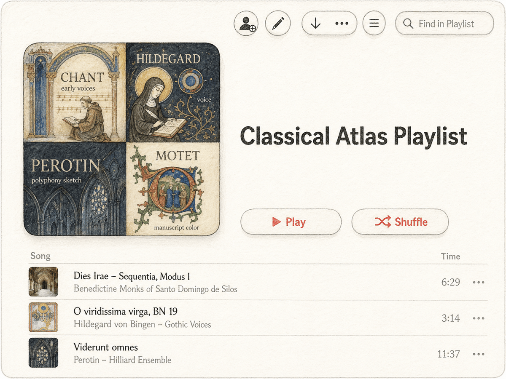

# Listening Atlas Agent Kit

Listening Atlas is a documentation-first kit for asking browser or computer-use AI agents to build music listening guides, ordered playlists, and static ebook-style releases. It is meant for Codex, Claude Code, and similar agents that can read files, browse the web, and operate a streaming service UI.

中文说明见 [README.zh-CN.md](README.zh-CN.md).

<p align="center">
  
</p>

## What This Is

This repository gives an agent the editorial workflow, data contracts, prompts, and QA checks needed to create a music guide from scratch. The core kit lives in [docs/](docs), [specs/](specs), [prompts/](prompts), and [templates/](templates). It does not ship platform automation scripts.

The included reference product is **Classical Atlas**, a finished classical music demo with Chinese and English guides, playlist TSV files, Apple Music execution logs, release ZIPs, and a [GitHub Pages ebook](https://qinip.github.io/listening-atlas/). Treat it as an example of what the kit can produce, not as the only possible output. The reusable method is platform-agnostic; the Classical Atlas demo is an Apple Music case-study edition.

## Quick Start

Clone or download the repository. Then give your agent one entry point:

```text
Read docs/AGENT_HANDOFF.md first and use it as the entry point for this repository.
Help me create a music listening guide, playlist TSV, and platform playlist for [genre or domain].
Target platform: [Apple Music / Spotify / YouTube Music / YouTube / TIDAL / NetEase Cloud Music / other].
Target size: about [50 / 100 / 180] tracks.
Language: [English / Chinese / other].
Ask me for any missing project-brief choices, then follow the kit.
```

The handoff file tells the agent which docs, specs, templates, and prompts to read next. You do not need to paste a long file list into the first message. For a detailed human-readable walkthrough, use [docs/USAGE.md](docs/USAGE.md).

## What You Can Customize

A run starts with a project brief. The agent should ask about the music domain, audience, language, platform, track count, difficulty mix, regional coverage, and how much modern or screen-based music to include. Those choices feed the playlist schema, guide outline, platform search strategy, and QA checks.

For classical music, the bundled Classical Atlas product is a useful reference. For jazz, rock, opera traditions, film music, game music, regional folk music, or other domains, keep the core deliverables and add a domain extension when the field needs different metadata. The extension layer is documented in [specs/EXTENSION_CONTRACT.md](specs/EXTENSION_CONTRACT.md), with examples in [specs/extensions/](specs/extensions).

## Deliverables

A complete agent run should produce a project brief, a platform-agnostic playlist TSV, a platform execution log if a real playlist was created, a Markdown guide, a static HTML ebook, and an asset manifest if images are bundled. The exact acceptance rules live in [specs/DELIVERABLES.md](specs/DELIVERABLES.md).

The Classical Atlas demo is available on GitHub Pages and as release ZIPs. The ZIPs are demo product artifacts. To use the kit for your own project, start from the repository docs rather than from a demo ZIP.

## Assets And Publishing

The kit uses a conservative publishing policy. Bundled images should be public domain, CC0, or clearly reusable under a compatible open license, with source, creator, license, attribution, and reuse notes recorded in an asset manifest. Platform album art, artist photos, thumbnails, and platform screenshots should be linked or recreated as generic illustrations rather than copied into the repo.

## License

Reusable kit materials in `docs/`, `specs/`, `prompts/`, and `templates/` are dedicated under [CC0 1.0](LICENSE.md). Finished demo products, sample guide text, sample playlist data, and site guide content are licensed under [CC BY 4.0](LICENSE.md), unless a specific file says otherwise.

Third-party sources keep their own licenses and terms. This repository does not provide legal advice.
